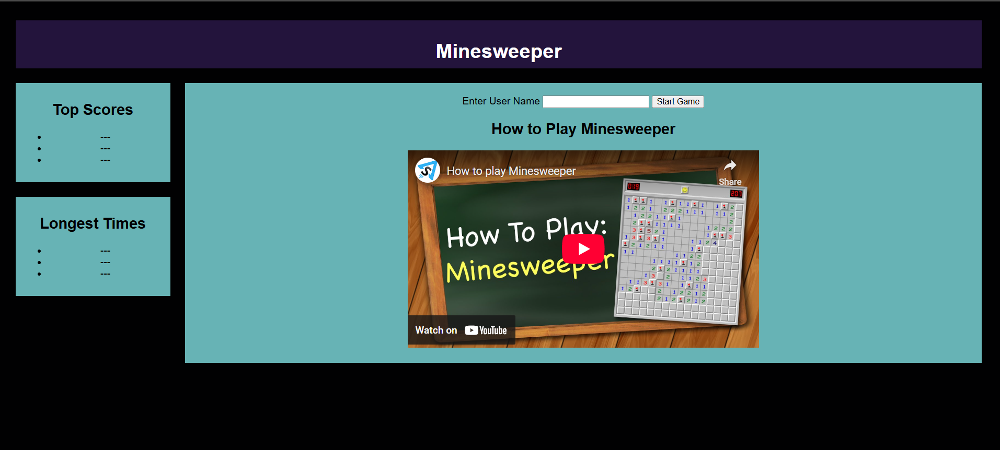
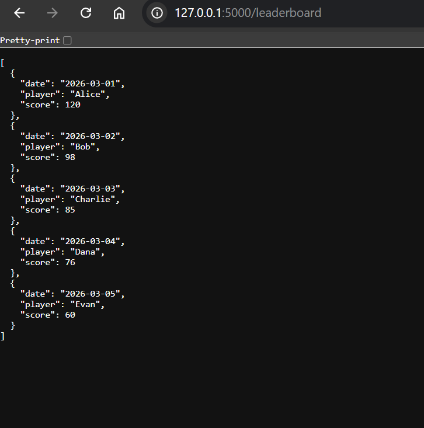

# Minesweeper Strategy Game – Prototype

## Prototype Overview
Covers the functionality of my web-based mine sweeper strategy game. Creating the prototype using HTML and CSS. Blinking the front-end interface to the back-end server logic and database interaction using Python Flask, SQLite database, and JavaScript, I was able to create this prototype as the first building blocks of my game.
---
## Technologies Used
- Python
- Flask
- SQLite Database
- HTML5
- CSS
- JavaScript
- GitHub for version control
---

## Current Prototype Features

### Game Interface Layout
The prototype includes a basic user interface that reflects the planned layout of the final application.
Features include:
- Application banner labeled **Minesweeper**
- User input field for entering a player name
- Start Game button
- Placeholder Minesweeper game board
- Two leaderboard columns:
  - Top Scores
  - Longest Times

This layout was designed using HTML and CSS and is structured to support future interactive gameplay logic.
---

### Leaderboard System
The application includes a functioning backend API that retrieves leaderboard data from an SQLite database.
Flask API endpoint- The leaderboard page dynamically loads and displays these records using JavaScript.

---

### Database Integration

The prototype uses SQLite to store player score data.
This will be how game results can later be recorded and displayed.
---
### Instructional Video Integration
A YouTube video has been embedded in the leaderboard to enhance the web application's feel and help players understand how to play the game correctly. 
---

## Screenshots
- Home page layout

- Game interface
On the game page, you will see the actual game board with a button to quit the application. This, of course, will expand and have more areas.

- Leaderboard page
The leaderboard page has the most done within the prototype. It has two columns, one for the top score and one for the top leaders. On the right side of the screen, there is a text box and a button where a player can enter a username and begin playing. It has a YouTube video embedded to show people how to play the Minesweeper game

- Database results
This is a quick result of what the database looks like and shows how it is integrated inside the project already with SQLite

